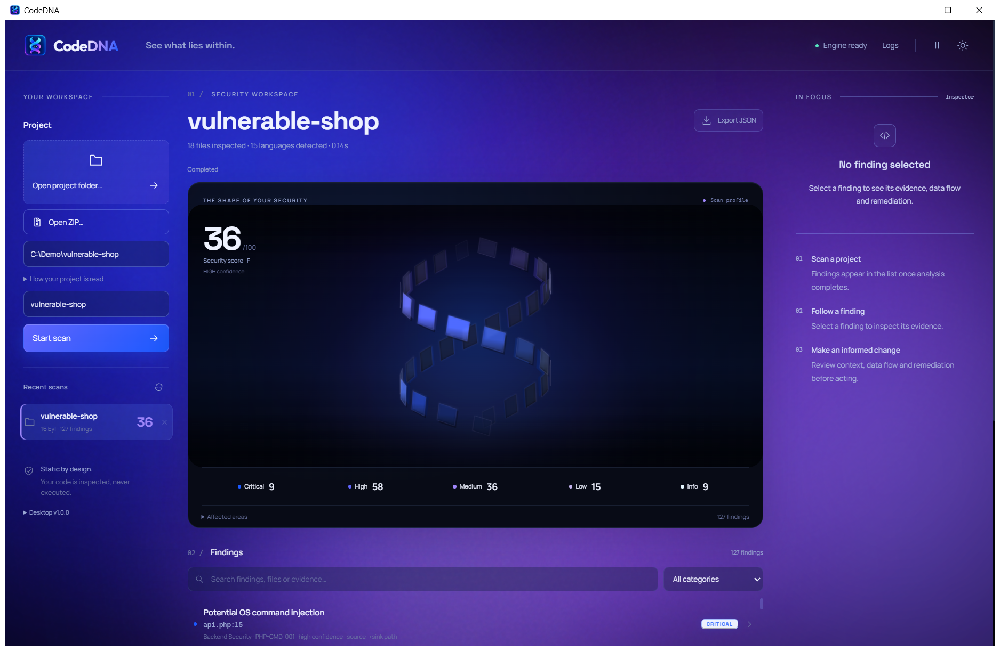
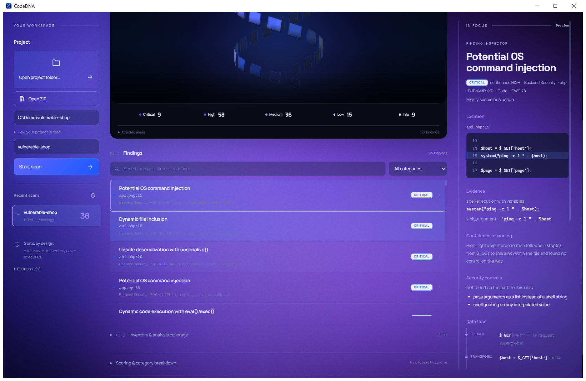
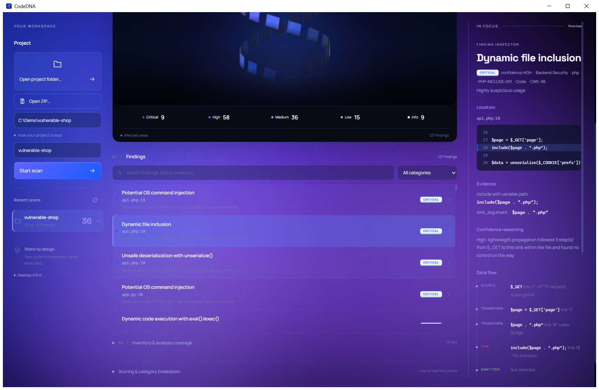
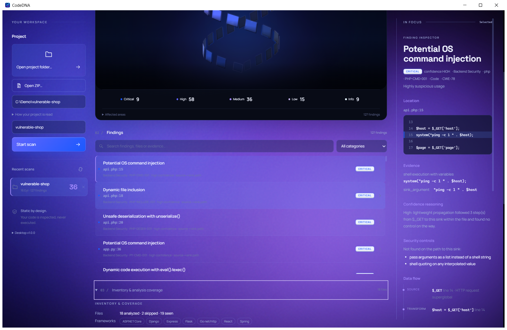

<div align="center">

# CodeDNA

### Desktop Security Analysis & Code Intelligence

**Inspect local codebases. Surface security findings. Understand framework context. Investigate evidence.**

CodeDNA is a Windows desktop security-analysis and code-intelligence tool built to analyze software projects locally and turn source code, configuration, dependencies and project structure into structured security findings and technical context.

**Windows 10 / 11 · x64 · Local Analysis · Offline-first**

</div>

---



## Security intelligence for real codebases

CodeDNA combines static security analysis with project intelligence in a single desktop workflow.

Instead of treating a repository as a collection of isolated files, the engine identifies languages, technologies, frameworks, configuration, dependencies, entry points and security-relevant patterns to provide additional context around its findings.

Source code is analyzed directly on the local machine.

No project upload is required.

---

## Engine at a Glance

| | |
| --- | ---: |
| **Framework Profiles** | **155** |
| **Security Rules** | **125** |
| **Recognized Extensions & File Patterns** | **110** |
| **Supported Languages & File Formats** | **28** |
| **With Analyzer Coverage** | **19** |
| **Analyzers** | **13** |

### 155 Framework Profiles

Framework awareness is a core part of CodeDNA's project-intelligence layer.

The engine contains **155 framework profiles** used to recognize framework and technology context across supported ecosystems.

This allows a scan to understand more about the environment surrounding the code rather than relying only on file extensions or isolated source patterns.

Framework information can contribute to:

- project inventory
- technology identification
- analyzer context
- entry-point discovery
- security-rule context
- dependency and manifest interpretation
- scan coverage information

Framework-profile coverage does not mean that every framework receives its own dedicated semantic analyzer. Framework recognition and language-analysis depth are separate capabilities.

---

## What CodeDNA Analyzes

CodeDNA currently performs security analysis across areas including:

- Input Safety
- Backend Security
- Data Protection
- Configuration
- Secrets
- Cryptography
- Browser Security
- Authorization
- Dependency Health
- Infrastructure
- Authentication

The engine combines language-specific security rules with language-agnostic checks.

Additional project analysis includes:

- secret detection
- configuration inspection
- dependency and manifest analysis
- framework detection
- project inventory
- language detection
- analysis coverage reporting
- entry-point discovery (engine / JSON export)
- project relationship data (engine / JSON export)
- Security DNA scoring
- confidence information

---

## Findings with Evidence

CodeDNA is designed to expose the information available behind a finding rather than showing only a severity label.



Depending on the applicable analyzer and rule, a finding may include:

- severity
- rule identifier
- CWE reference
- affected file
- source location
- code excerpt
- supporting evidence
- confidence reasoning
- missing security controls
- observed source / transform / sink context

A finding can therefore carry analysis context such as:

```text
SOURCE
   ↓
TRANSFORM
   ↓
SINK
```

The exact evidence available depends on the language, rule and analyzer responsible for the finding.

## Findings Workspace



The findings workspace provides a focused environment for investigating detected security issues.

Results can be searched and filtered to make larger scans easier to review, while the finding inspector exposes the evidence and analysis context available for an individual result.

CodeDNA is designed to make the path from detection to investigation clear without implying that every finding is automatically exploitable.

---

## Project Intelligence



Alongside security findings, CodeDNA builds an inventory of the scanned project.

Project intelligence can include:

- detected languages and file formats
- analyzer coverage
- recognized frameworks
- technologies
- databases
- manifests and dependencies
- project files
- discovered entry points (engine / JSON export)
- relationship information generated by the engine (engine / JSON export)

This information provides technical context for interpreting scan results and understanding what CodeDNA was able to inspect.

---

## Framework Intelligence

Framework context is a major part of CodeDNA's project-intelligence layer.

The engine currently contains:

# **155 Framework Profiles**

These profiles help CodeDNA recognize framework and technology context across supported ecosystems.

Framework awareness can contribute to:

- project inventory
- technology identification
- analyzer context
- entry-point discovery
- security-rule context
- dependency and manifest interpretation
- scan coverage information

The framework profiles complement the language analyzers.

They must not be interpreted as 155 separate analyzers or as deep semantic analysis of 155 frameworks.

```text
Source Files
     ↓
Language Detection
     ↓
Framework / Technology Recognition
     ↓
Analyzer Context
     ↓
Security Findings + Project Intelligence
```

The purpose of the framework-intelligence layer is to understand more about the environment surrounding the source code than file-extension detection alone can provide.

---

## Analysis Depth

CodeDNA deliberately distinguishes between recognition, analyzer coverage and analysis depth.

A supported language or file format is not automatically presented as having deep semantic analysis.

| Analysis level | Languages / formats | Dedicated analyzer coverage |
| --- | --- | --- |
| **Semantic AST + taint/data-flow analysis** | Python | Yes |
| **Static analysis + lightweight intra-file flow** | JavaScript, TypeScript, PHP, HTML | Yes |
| **Static security analysis** | C#, Go, Java, SQL | Yes |
| **Configuration / value analysis** | Dockerfile, Docker Compose, dotenv, INI, JSON, Properties, TOML, XML, YAML | Yes |
| **Generic / resource analysis** | CSS | Yes |
| **Generic / language-agnostic checks** | Markdown, Shell, Text | No dedicated analyzer |
| **Detection only** | C, C++, Kotlin, Ruby, Rust, Swift | No |

This distinction is intentional.

The first five analyzer-covered groups above contain exactly **19 languages / file formats**.

Markdown, Shell and Text can participate in applicable generic or language-agnostic checks, but they do not have dedicated analyzer coverage and therefore are not included in the **19 with analyzer coverage** metric.

Detection-only languages are recognized for project inventory but do not currently receive dedicated analyzer analysis.

---

## Engine Capability Summary

| Capability | Verified count |
| --- | ---: |
| **Framework profiles** | **155** |
| **Security rules** | **125** |
| **Recognized extensions & file patterns** | **110** |
| **Supported languages & file formats** | **28** |
| **With analyzer coverage** | **19** |
| **Analyzers** | **13** |

These numbers describe different parts of the engine and should not be treated as interchangeable metrics.

In particular:

* 155 framework profiles does not mean 155 analyzers.
* 28 supported languages / file formats does not mean 28 deep analyzers.
* 19 with analyzer coverage does not mean the remaining formats are completely ignored.
* generic language-agnostic checks are distinct from dedicated analyzer coverage.

---

## Local by Design

CodeDNA analyzes selected projects directly on the local machine.

The normal desktop workflow does not require:

* uploading source code
* a remote analysis API
* a localhost HTTP service
* an external browser window
* a separately installed Python environment
* Node.js or npm
* FastAPI or Uvicorn

Selected project folders and ZIP archives are processed by the packaged local analysis engine.

---

## Desktop Workflow

```text
Select Project
      ↓
Detect Languages & Technologies
      ↓
Recognize Framework Context
      ↓
Run Security Analysis
      ↓
Calculate Security DNA
      ↓
Review Findings
      ↓
Inspect Evidence & Context
      ↓
Export Results
```

Projects can be selected from either:

* a local directory
* a ZIP archive

---

## Installation

### Requirements

* Windows 10 or Windows 11
* x64 architecture

### Install CodeDNA

1. Open the latest CodeDNA GitHub Release.
2. Download:

```text
CodeDNA-Windows-x64.zip
```

3. Extract the archive.
4. Open the extracted `CodeDNA` folder.
5. Run:

```text
CodeDNA.exe
```

No separate Python, Node.js or npm installation is required.

### Windows SmartScreen

The current Windows release is not code-signed.

Windows SmartScreen may therefore display a warning when the downloaded executable is launched.

This limitation must remain documented until a signed Windows build is actually released.

---

## Command-Line Scanning

The packaged executable also supports headless project scans.

```text
CodeDNA.exe --scan <path>
```

To write the result as JSON:

```text
CodeDNA.exe --scan <path> --json result.json
```

The command performs the analysis, writes the requested result and exits.

It does not start a localhost server or open an external browser.

---

## Structured JSON Export

Scan results can be exported as structured JSON.

Depending on the scanned project and available analysis coverage, engine output can include:

* security findings
* project information
* detected languages
* framework information
* technology inventory
* coverage information
* discovered entry points
* project relationship data

Entry-point discovery and project relationship data currently exist at the engine / JSON-export level.

The Windows v1.0.0 desktop interface does **not** currently provide a dedicated interactive graph visualization.

---

## Desktop Architecture

CodeDNA is distributed as a standalone Windows desktop application.

```text
CodeDNA.exe
    ↓
Desktop Window
    ↓
Embedded WebView2 Interface
    ↓
Local Desktop Bridge
    ↓
CodeDNA Analysis Engine
```

The desktop interface is rendered through Microsoft WebView2.

`msedgewebview2.exe` helper processes may therefore appear while CodeDNA is running. These belong to the embedded renderer and do not mean that CodeDNA has opened a normal Microsoft Edge browser window.

The application itself does not require a listening HTTP port during normal desktop operation.

---

## Offline-first Analysis

Core CodeDNA static analysis is designed to operate locally without an internet connection.

The analysis engine does not require a remote API or cloud analysis service for normal project scans.

Operating-system components such as the embedded WebView2 runtime may independently perform platform-level background activity. Such activity is separate from the CodeDNA analysis engine.

---

## Windows Validation

The packaged Windows x64 release has been validated for:

* desktop application startup
* local project scanning
* security finding generation
* finding-detail inspection
* severity and category filtering
* scan history
* native folder selection
* native ZIP selection
* native save/export dialogs
* JSON export
* project-model generation
* relationship-graph generation at engine / export level
* operation without separately installed Python
* operation without Node.js or npm
* no external browser launch during normal desktop operation
* no localhost dependency
* no application listening port during normal desktop operation

Regression coverage is maintained to help prevent removed localhost/server dependencies and browser-launch behavior from being accidentally reintroduced into the desktop runtime.

---

## Security Scope

CodeDNA is a static-analysis tool.

Findings are security indicators that require human review.

A detected finding does not automatically prove practical exploitability.

Likewise, a scan with no findings does not prove that an application is secure.

Static analysis should be used as one component of a broader secure-development and security-testing process.

---

# Supported Languages & File Formats

CodeDNA currently recognizes **28 supported languages and file formats**.

Of those 28, **19 have analyzer coverage**.

The remaining formats may have generic checks or detection-only coverage as explicitly described below.

## Semantic Analysis

### Python

**Analyzer coverage: Yes**

Current analysis includes:

* AST-based analysis
* semantic inspection
* taint / data-flow tracking
* language-specific security rules

Python currently receives CodeDNA's deepest language-analysis coverage.

---

## Static Analysis + Lightweight Intra-file Flow

### JavaScript

### TypeScript

### PHP

### HTML

**Analyzer coverage: Yes**

These languages receive static security analysis with lightweight intra-file flow analysis.

---

## Static Security Analysis

### C#

### Go

### Java

### SQL

**Analyzer coverage: Yes**

These languages receive dedicated static security analysis.

---

## Configuration & Value Analysis

### Dockerfile

### Docker Compose

### dotenv

### INI

### JSON

### Properties

### TOML

### XML

### YAML

**Analyzer coverage: Yes**

These formats receive dedicated configuration and value analysis for applicable security-relevant patterns.

---

## Generic / Resource Analysis

### CSS

**Analyzer coverage: Yes**

CSS participates in resource-oriented analysis through dedicated analyzer coverage.

---

## Generic / Language-Agnostic Checks

### Markdown

### Shell

### Text

**Dedicated analyzer coverage: No**

These formats can still receive applicable generic or language-agnostic checks, including checks that operate across textual project resources.

They are recognized by CodeDNA, but they are **not** included in the metric:

`19 with analyzer coverage`

This distinction must remain explicit.

---

## Detection-only Coverage

### C

### C++

### Kotlin

### Ruby

### Rust

### Swift

**Dedicated analyzer coverage: No**

These languages are recognized and included in project inventory.

They do not currently receive the same analyzer depth as the analyzer-covered languages and formats above.

---

## All 28 Supported Languages / File Formats

| # | Language / format | Current coverage | Analyzer coverage |
| -: | --- | --- | --- |
| 1 | Python | Semantic AST + taint/data-flow | Yes |
| 2 | JavaScript | Static + lightweight intra-file flow | Yes |
| 3 | TypeScript | Static + lightweight intra-file flow | Yes |
| 4 | PHP | Static + lightweight intra-file flow | Yes |
| 5 | HTML | Static + lightweight intra-file flow | Yes |
| 6 | C# | Static security analysis | Yes |
| 7 | Go | Static security analysis | Yes |
| 8 | Java | Static security analysis | Yes |
| 9 | SQL | Static security analysis | Yes |
| 10 | Dockerfile | Configuration / value analysis | Yes |
| 11 | Docker Compose | Configuration / value analysis | Yes |
| 12 | dotenv | Configuration / value analysis | Yes |
| 13 | INI | Configuration / value analysis | Yes |
| 14 | JSON | Configuration / value analysis | Yes |
| 15 | Properties | Configuration / value analysis | Yes |
| 16 | TOML | Configuration / value analysis | Yes |
| 17 | XML | Configuration / value analysis | Yes |
| 18 | YAML | Configuration / value analysis | Yes |
| 19 | CSS | Generic / resource analysis | Yes |
| 20 | Markdown | Generic / language-agnostic checks | No dedicated analyzer |
| 21 | Shell | Generic / language-agnostic checks | No dedicated analyzer |
| 22 | Text | Generic / language-agnostic checks | No dedicated analyzer |
| 23 | C | Detection only | No |
| 24 | C++ | Detection only | No |
| 25 | Kotlin | Detection only | No |
| 26 | Ruby | Detection only | No |
| 27 | Rust | Detection only | No |
| 28 | Swift | Detection only | No |

This table is the authoritative README representation of the current language/file-format coverage.

The arithmetic must remain:

```text
28 supported languages / file formats
19 with analyzer coverage

19 analyzer-covered
+ 3 generic without dedicated analyzer
+ 6 detection-only
= 28 total
```

---

## Repository Scope

`CodeDNA-Windows` is the public Windows distribution and product-showcase repository for CodeDNA.

It contains release-facing material including documentation, screenshots, changelog information and release documentation.

The CodeDNA core source code is not distributed through this repository.

---

## Release

**CodeDNA v1.0.0 — Windows x64**

Distribution package:

```text
CodeDNA-Windows-x64.zip
```

---

## License

CodeDNA is distributed under the terms provided in the repository's [`LICENSE`](LICENSE) file.

Copyright © 2026 Helinity.
